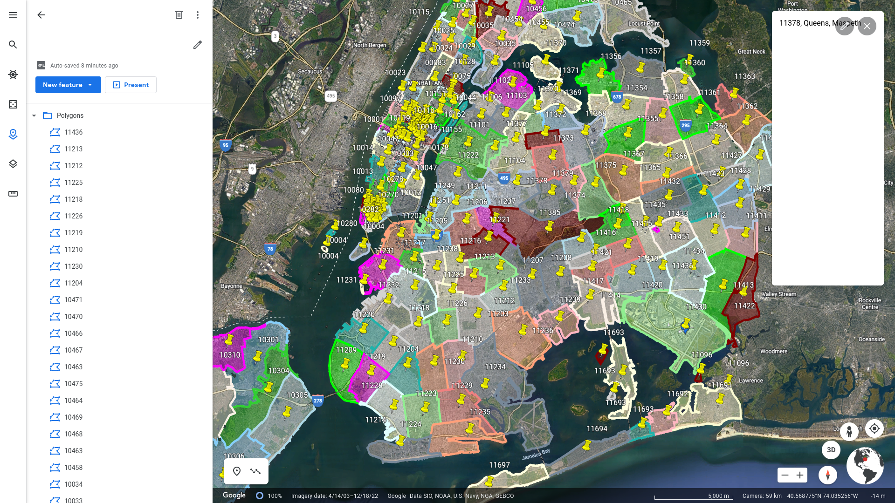

This is a tiny script that converts shape file into KML. Specifically, the task
was to get KML with New York Zip codes.

The script is in Python and uses `geopandas` and `simplekml`.

### Data Sources
Original shape file with all regions and their zip codes can be found here.

  - https://data.cityofnewyork.us/Business/Zip-Code-Boundaries/i8iw-xf4u
  - https://catalog.data.gov/dataset/zip-code-boundaries

Seems like the file was created a long time ago, not sure if it is still relevant:

```sh
$ unzip -l ZIP_CODE_040114.zip
Archive:  ZIP_CODE_040114.zip
  Length      Date    Time    Name
---------  ---------- -----   ----
     2204  2014-04-01 12:05   ZIP_CODE_040114.shx
    89312  2014-04-01 12:05   ZIP_CODE_040114.dbf
      562  2014-04-01 12:05   ZIP_CODE_040114.prj
     2916  2014-04-01 12:05   ZIP_CODE_040114.sbn
      364  2014-04-01 12:05   ZIP_CODE_040114.sbx
  2253760  2014-04-01 12:05   ZIP_CODE_040114.shp
    10252  2014-04-01 12:05   ZIP_CODE_040114.shp.xml
---------                     -------
  2359370                     7 files
```


### Pipenv and run

```sh
$ pipenv install
...

$ pipenv run ./main.py ZIP_CODE_040114.zip
263 shapes found
writing them to ZIP_CODE_040114.kml
```

Now you can magically convert KML to KMZ and save some space:

```
$ zip ZIP_CODE_040114.kmz ZIP_CODE_040114.kml
  adding: ZIP_CODE_040114.kml (deflated 66%)

$ ls -lh ZIP_CODE_040114.*
-rw-r--r-- 1 user user 5.7M Jan 18 20:40 ZIP_CODE_040114.kml
-rw-r--r-- 1 user user 2.0M Jan 18 20:40 ZIP_CODE_040114.kmz
```

### Look!

The KML-file can be imported into Google Earth and looks like this:




### FIXME
Spent some time to get nicer pin icons but without any success.
